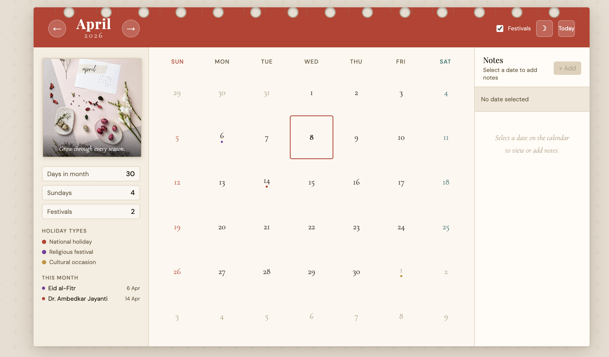
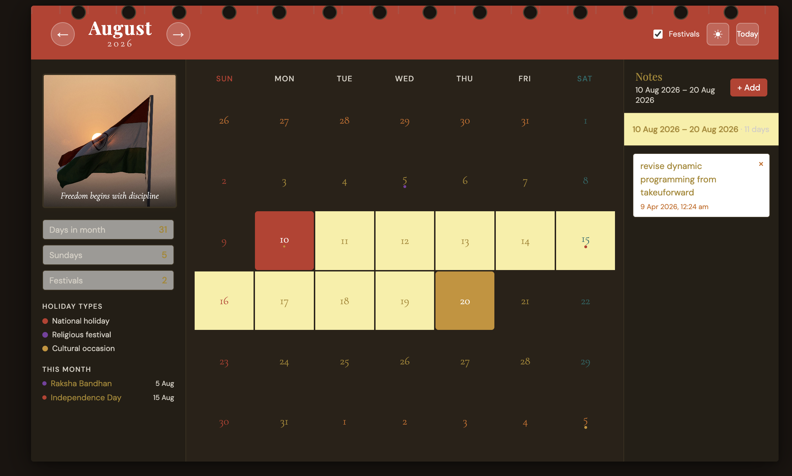
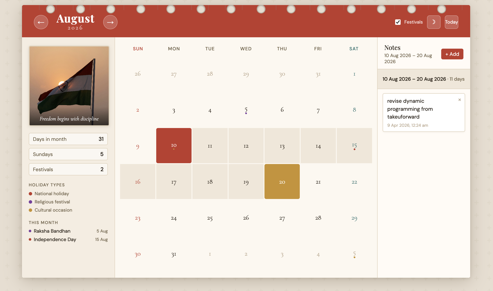

# 🗓️ Wall Calendar

A production-quality interactive wall calendar built with **Next.js App Router**, designed to look and feel like a physical wall calendar with modern UX enhancements.

---
## 🔗 Live Demo
https://wall-calender-qjhwex6nj-chhavidablas-projects.vercel.app/

## 📸 Preview

### 🗓️ Main Calendar View


### 🌙 Dark Mode


### 📝 Notes Panel


## ✨ Features

### Core
- **Wall Calendar UI** — Inspired by physical paper calendars with spiral binding, hero image panel, paper textures, and classic typography (Playfair Display + Cormorant Garamond)
- **Date Range Selection** — Click once to set start, click again to set end. Visual states for start (red), end (gold), and in-range (warm fill). Click a third time to reset.
- **Indian Holidays & Festivals** — 2025 and 2026 data with color-coded dots for national (red), religious (purple), and cultural (gold) events
- **Notes System** — Add, view, and delete date-specific notes persisted via `localStorage`. Notes indicator on calendar days.

### Advanced
- **Dark Mode** — Full dark theme toggle with warm dark palette
- **Holiday Filter Toggle** — Show/hide all festival dots and panels
- **Today Highlight** — Red border ring around today's date
- **Keyboard Navigation** — `←` / `→` to navigate months, `Ctrl+Enter` to save notes
- **Slide Animations** — Month transitions with directional slide
- **Tooltips** — Hover any date with holidays or notes to see a quick summary
- **Stats Panel** — Days in month, Sundays, and festival count at a glance
- **Monthly Hero Images** — Curated Unsplash photos rotating by month (Himalayas, Taj Mahal, Diwali, etc.)

---

## 🗂️ Folder Structure

```
src/
└── app/
    ├── page.js                    # App Router entry
    ├── layout.js                  # Root layout with Google Fonts
    ├── components/
    │   ├── WallCalendar.js        # Main orchestration component
    │   ├── CalendarGrid.js        # Day grid renderer
    │   ├── DayCell.js             # Individual day cell with states
    │   ├── NotesPanel.js          # Notes sidebar (add/view/delete)
    │   ├── LeftPanel.js           # Hero image, stats, and legend
    │   └── useCalendar.js         # Central state management hook
    └── data/
        └── holidays.js            # Indian holidays 2025–2026 + helpers
```

---
## 🛠️ Tech Stack

- Next.js (App Router)
- React (Hooks)
- JavaScript (ES6+)
- CSS-in-JS (inline styles + CSS variables)
- localStorage (persistence)

## 🚀 Running Locally

```bash
# Clone or copy the project
cd wall-calendar

# Install dependencies
npm install

# Run development server
npm run dev
```

Open [http://localhost:3000](http://localhost:3000).

### Deploy to Vercel

```bash
npx vercel
```

No environment variables needed — fully static frontend with `localStorage`.

---

## 🎨 Design Decisions

### Aesthetic Direction
The calendar channels a **refined editorial print aesthetic** — warm paper tones, serif display typography, and subtle textures to evoke physical wall calendars. The red accent (`#c0392b`) is traditional calendar red, grounding the digital experience in the familiar.

### Typography
- **Playfair Display** — Month name: authoritative, editorial
- **Cormorant Garamond** — Day numbers and labels: elegant, readable at small sizes
- **DM Sans** — UI elements and notes: clean, modern contrast to the serifs

### State Management
`useCalendar.js` is a single custom hook managing all calendar state. This keeps `WallCalendar.js` as a pure layout orchestrator and makes each sub-component independently testable. No external state libraries needed.

### Date Range UX
- First click → sets start (red)
- Second click → sets end (gold), fills range (warm)
- Clicking an earlier date than start → resets start (avoids invalid states)
- Third click anywhere → resets entire range
- Escape key → clears selection

### CSS Variables for Theming
All colors are expressed as CSS custom properties (`--cal-ink`, `--cal-paper`, etc.) injected as inline styles on the root container. This enables instant dark mode toggling without class manipulation or re-renders of leaf components.

### localStorage Schema
```json
{
  "2026-04-08": [
    { "id": 1712567890000, "text": "Dentist appointment", "timestamp": "8 Apr 2026, 10:30 AM" }
  ]
}
```

---

## 📅 Holiday Data Coverage

| Category | Examples |
|----------|---------|
| National | Republic Day, Independence Day, Gandhi Jayanti, Ambedkar Jayanti |
| Religious | Diwali, Holi, Eid, Navratri, Janmashtami, Ram Navami, Shivratri |
| Cultural | Makar Sankranti, Rath Yatra, Teachers' Day, New Year's Eve |

Data covers 2025 and 2026. Extend by adding entries to `src/app/data/holidays.js`.

## 🚧 Future Improvements

- Year navigation (jump to specific year)
- Drag-based range selection
- Backend sync for notes (Firebase / Supabase)
- i18n support for regional calendars
- Performance optimization using memoization for large datasets
